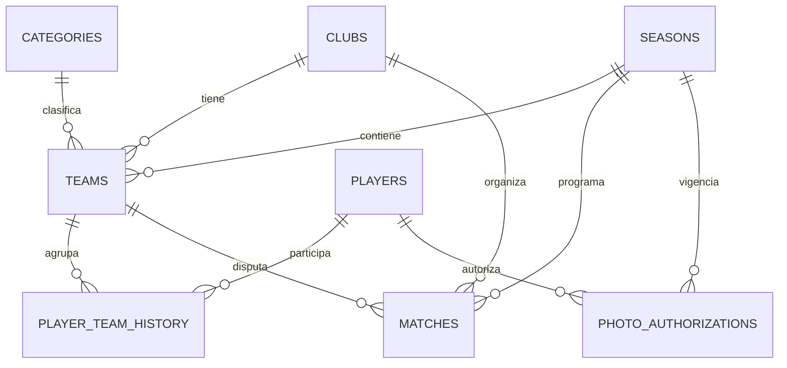
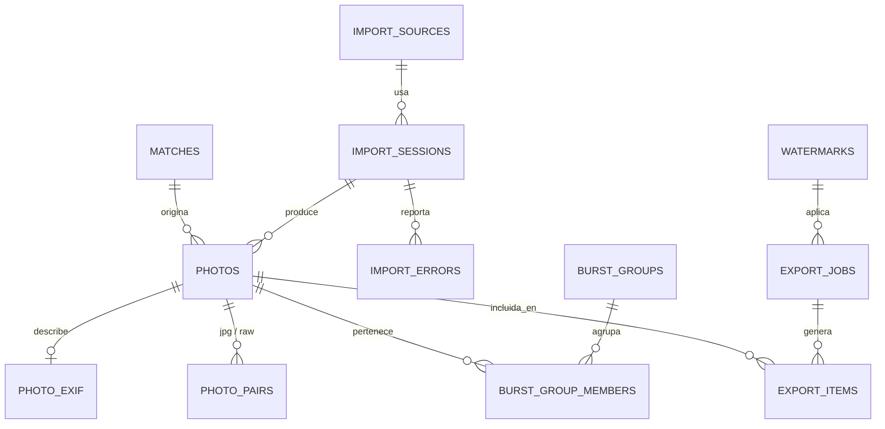

# TAC MatchPhoto — Esquema de Base de Datos (SQLite)

> Motor: SQLite, `PRAGMA journal_mode=WAL`, `PRAGMA foreign_keys=ON`.
> Migraciones: archivos `.sql` versionados en `src-tauri/migrations/`, aplicados con `refinery` (que gestiona su propia tabla de control `refinery_schema_history`).
> Convención: claves primarias `INTEGER PRIMARY KEY` (rowid), timestamps en `TEXT` formato ISO-8601 UTC, booleanos como `INTEGER 0/1`.
> Este documento describe el esquema objetivo de la migración inicial (`V1__init.sql`). No se ha ejecutado ni probado todavía: es la especificación a implementar en la Fase 0.

## 1. Diagrama de entidad-relación — dominio de catálogo

## 2. Diagrama de entidad-relación — dominio de fotografías

## 3. Dominio: Catálogo

### `seasons` — Temporadas

| Columna | Tipo | Restricciones |
|---|---|---|
| id | INTEGER | PK |
| name | TEXT | NOT NULL, UNIQUE (p. ej. "2025/2026") |
| start_date | TEXT | NOT NULL |
| end_date | TEXT | NULL |
| is_active | INTEGER | NOT NULL DEFAULT 0 |
| notes | TEXT | NULL |
| created_at | TEXT | NOT NULL |
| updated_at | TEXT | NOT NULL |

### `clubs` — Clubes

| Columna | Tipo | Restricciones |
|---|---|---|
| id | INTEGER | PK |
| name | TEXT | NOT NULL, UNIQUE |
| short_name | TEXT | NULL |
| notes | TEXT | NULL |
| created_at | TEXT | NOT NULL |
| updated_at | TEXT | NOT NULL |

### `categories` — Categorías (p. ej. Alevín, Infantil, Cadete)

| Columna | Tipo | Restricciones |
|---|---|---|
| id | INTEGER | PK |
| name | TEXT | NOT NULL, UNIQUE |
| description | TEXT | NULL |
| created_at | TEXT | NOT NULL |
| updated_at | TEXT | NOT NULL |

### `teams` — Equipos (instancia club + categoría + temporada)

| Columna | Tipo | Restricciones |
|---|---|---|
| id | INTEGER | PK |
| club_id | INTEGER | NOT NULL, FK → clubs.id |
| category_id | INTEGER | NOT NULL, FK → categories.id |
| season_id | INTEGER | NOT NULL, FK → seasons.id |
| name | TEXT | NOT NULL (p. ej. "Alevín A") |
| notes | TEXT | NULL |
| created_at | TEXT | NOT NULL |
| updated_at | TEXT | NOT NULL |

`UNIQUE(club_id, category_id, season_id, name)`. Índices: `(season_id)`, `(club_id)`.

### `players` — Jugadores (persona, independiente de equipo/temporada)

| Columna | Tipo | Restricciones |
|---|---|---|
| id | INTEGER | PK |
| first_name | TEXT | NOT NULL |
| last_name | TEXT | NOT NULL |
| birth_date | TEXT | NULL |
| notes | TEXT | NULL |
| created_at | TEXT | NOT NULL |
| updated_at | TEXT | NOT NULL |

Índice: `(last_name, first_name)` para búsqueda.

### `player_team_history` — Historial del jugador por equipo y temporada

| Columna | Tipo | Restricciones |
|---|---|---|
| id | INTEGER | PK |
| player_id | INTEGER | NOT NULL, FK → players.id |
| team_id | INTEGER | NOT NULL, FK → teams.id |
| jersey_number | INTEGER | NULL |
| position | TEXT | NULL |
| notes | TEXT | NULL |
| created_at | TEXT | NOT NULL |
| updated_at | TEXT | NOT NULL |

`UNIQUE(player_id, team_id)`. La temporada se deriva de `teams.season_id` (no se duplica). Índice: `(team_id)`, `(player_id)`.

### `matches` — Partidos

| Columna | Tipo | Restricciones |
|---|---|---|
| id | INTEGER | PK |
| season_id | INTEGER | NOT NULL, FK → seasons.id |
| club_id | INTEGER | NOT NULL, FK → clubs.id |
| team_id | INTEGER | NOT NULL, FK → teams.id |
| opponent_name | TEXT | NOT NULL |
| match_date | TEXT | NOT NULL (fecha+hora ISO-8601) |
| venue | TEXT | NULL |
| is_home | INTEGER | NOT NULL DEFAULT 1 |
| competition | TEXT | NULL |
| status | TEXT | NOT NULL DEFAULT 'scheduled' — `scheduled` \| `played` \| `cancelled` |
| notes | TEXT | NULL |
| created_at | TEXT | NOT NULL |
| updated_at | TEXT | NOT NULL |

Índices: `(season_id)`, `(team_id)`, `(match_date)`.

### `photo_authorizations` — Autorizaciones para fotografiar

| Columna | Tipo | Restricciones |
|---|---|---|
| id | INTEGER | PK |
| player_id | INTEGER | NOT NULL, FK → players.id |
| season_id | INTEGER | NOT NULL, FK → seasons.id |
| authorized | INTEGER | NOT NULL DEFAULT 0 |
| signed_date | TEXT | NULL |
| document_reference | TEXT | NULL (p. ej. ruta/nombre del documento firmado, no el documento en sí) |
| notes | TEXT | NULL |
| created_at | TEXT | NOT NULL |
| updated_at | TEXT | NOT NULL |

`UNIQUE(player_id, season_id)`.

## 4. Dominio: Importación y fotografías

### `import_sources` — Fuentes de importación

| Columna | Tipo | Restricciones |
|---|---|---|
| id | INTEGER | PK |
| source_type | TEXT | NOT NULL — `card` \| `folder` \| `external_disk` |
| label | TEXT | NULL (nombre amigable, p. ej. "Tarjeta CF Nikon") |
| root_path | TEXT | NOT NULL (última ruta conocida) |
| volume_serial | TEXT | NULL (número de serie de volumen Windows, para reconciliar cambios de letra de unidad) |
| volume_label | TEXT | NULL |
| default_import_mode | TEXT | NOT NULL DEFAULT 'copy' — `copy` \| `link` |
| created_at | TEXT | NOT NULL |

### `import_sessions` — Registro de operaciones de importación

| Columna | Tipo | Restricciones |
|---|---|---|
| id | INTEGER | PK |
| import_source_id | INTEGER | NOT NULL, FK → import_sources.id |
| match_id | INTEGER | NULL, FK → matches.id |
| import_mode | TEXT | NOT NULL — `copy` \| `link` |
| started_at | TEXT | NOT NULL |
| finished_at | TEXT | NULL |
| status | TEXT | NOT NULL DEFAULT 'running' — `running` \| `completed` \| `cancelled` \| `failed` |
| total_files_detected | INTEGER | NOT NULL DEFAULT 0 |
| files_imported | INTEGER | NOT NULL DEFAULT 0 |
| files_skipped_duplicate | INTEGER | NOT NULL DEFAULT 0 |
| files_failed | INTEGER | NOT NULL DEFAULT 0 |
| notes | TEXT | NULL |

Índice: `(match_id)`, `(status)`.

### `import_errors` — Errores por archivo durante importación

| Columna | Tipo | Restricciones |
|---|---|---|
| id | INTEGER | PK |
| import_session_id | INTEGER | NOT NULL, FK → import_sessions.id |
| file_path | TEXT | NOT NULL |
| error_message | TEXT | NOT NULL |
| created_at | TEXT | NOT NULL |

Índice: `(import_session_id)`.

### `photos` — Fotografías

| Columna | Tipo | Restricciones |
|---|---|---|
| id | INTEGER | PK |
| match_id | INTEGER | NOT NULL, FK → matches.id |
| import_session_id | INTEGER | NOT NULL, FK → import_sessions.id |
| original_path | TEXT | NOT NULL (ruta absoluta de origen en el momento de importar) |
| library_path | TEXT | NULL (ruta dentro de `Biblioteca/`; NULL si `import_mode = link`) |
| file_name | TEXT | NOT NULL |
| extension | TEXT | NOT NULL — `jpg` \| `jpeg` \| `nef` |
| is_raw | INTEGER | NOT NULL DEFAULT 0 |
| import_mode | TEXT | NOT NULL — `copy` \| `link` |
| file_size_bytes | INTEGER | NOT NULL |
| file_hash_sha256 | TEXT | NOT NULL, UNIQUE |
| captured_at | TEXT | NULL (EXIF DateTimeOriginal) |
| added_at | TEXT | NOT NULL |
| source_available | INTEGER | NOT NULL DEFAULT 1 |
| thumbnail_path | TEXT | NULL (Cache/) |
| preview_path | TEXT | NULL (Cache/) |
| width | INTEGER | NULL |
| height | INTEGER | NULL |
| camera_model | TEXT | NULL (desnormalizado de photo_exif para filtrado rápido) |
| status | TEXT | NOT NULL DEFAULT 'unreviewed' — ver §6 |
| rating | INTEGER | NOT NULL DEFAULT 0 — 0 a 5 |
| created_at | TEXT | NOT NULL |
| updated_at | TEXT | NOT NULL |

Índices: `UNIQUE(file_hash_sha256)`, `(match_id)`, `(status)`, `(rating)`, `(captured_at)`.

### `photo_exif` — Metadatos EXIF

| Columna | Tipo | Restricciones |
|---|---|---|
| id | INTEGER | PK |
| photo_id | INTEGER | NOT NULL, UNIQUE, FK → photos.id |
| camera_make | TEXT | NULL |
| camera_model | TEXT | NULL |
| lens_model | TEXT | NULL |
| iso | INTEGER | NULL |
| aperture | REAL | NULL |
| shutter_speed | TEXT | NULL (p. ej. "1/1000") |
| focal_length_mm | REAL | NULL |
| exposure_program | TEXT | NULL |
| white_balance | TEXT | NULL |
| flash | TEXT | NULL |
| orientation | INTEGER | NULL |
| gps_lat | REAL | NULL |
| gps_lon | REAL | NULL |
| date_time_original | TEXT | NULL |
| raw_exif_json | TEXT | NULL (volcado completo de tags devueltos por exiftool, para uso futuro sin nueva migración) |
| created_at | TEXT | NOT NULL |

### `photo_pairs` — Pares RAW + JPG detectados por nombre base

| Columna | Tipo | Restricciones |
|---|---|---|
| id | INTEGER | PK |
| jpg_photo_id | INTEGER | NOT NULL, UNIQUE, FK → photos.id |
| raw_photo_id | INTEGER | NOT NULL, UNIQUE, FK → photos.id |
| base_name | TEXT | NOT NULL |
| created_at | TEXT | NOT NULL |

### `burst_groups` — Grupos de ráfaga

| Columna | Tipo | Restricciones |
|---|---|---|
| id | INTEGER | PK |
| match_id | INTEGER | NOT NULL, FK → matches.id |
| camera_model | TEXT | NULL |
| started_at | TEXT | NOT NULL |
| ended_at | TEXT | NOT NULL |
| photo_count | INTEGER | NOT NULL DEFAULT 0 |
| created_at | TEXT | NOT NULL |

### `burst_group_members` — Fotos que pertenecen a un grupo de ráfaga

| Columna | Tipo | Restricciones |
|---|---|---|
| id | INTEGER | PK |
| burst_group_id | INTEGER | NOT NULL, FK → burst_groups.id |
| photo_id | INTEGER | NOT NULL, UNIQUE, FK → photos.id |
| sequence_index | INTEGER | NOT NULL |

Índice: `(burst_group_id)`.

> **Nota de diseño — estados y valoraciones:** `status` y `rating` se modelan como columnas directas de `photos` (valor vigente), no como tablas históricas separadas, porque el MVP solo necesita el valor actual por fotografía. El historial de cambios relevantes queda cubierto por la tabla genérica `activity_log` (§7), evitando una tabla de histórico por cada campo mutable sin necesidad real en esta fase.

## 5. Dominio: Exportación

### `watermarks` — Marcas de agua

| Columna | Tipo | Restricciones |
|---|---|---|
| id | INTEGER | PK |
| name | TEXT | NOT NULL |
| type | TEXT | NOT NULL — `image` \| `text` |
| image_path | TEXT | NULL (dentro de `MarcasDeAgua/`, requerido si type = image) |
| text_content | TEXT | NULL (requerido si type = text) |
| font_family | TEXT | NULL |
| font_size | INTEGER | NULL |
| color | TEXT | NULL |
| opacity_percent | INTEGER | NOT NULL DEFAULT 100 |
| position | TEXT | NOT NULL DEFAULT 'bottom_right' — p. ej. `bottom_right`, `bottom_left`, `top_right`, `top_left`, `center`, `tile` |
| margin_px | INTEGER | NOT NULL DEFAULT 24 |
| scale_percent | INTEGER | NOT NULL DEFAULT 100 |
| is_default | INTEGER | NOT NULL DEFAULT 0 |
| created_at | TEXT | NOT NULL |
| updated_at | TEXT | NOT NULL |

### `export_jobs` — Trabajos de exportación

| Columna | Tipo | Restricciones |
|---|---|---|
| id | INTEGER | PK |
| match_id | INTEGER | NULL, FK → matches.id |
| watermark_id | INTEGER | NULL, FK → watermarks.id |
| output_folder | TEXT | NOT NULL |
| format | TEXT | NOT NULL DEFAULT 'jpg' |
| quality_percent | INTEGER | NOT NULL DEFAULT 90 |
| max_dimension_px | INTEGER | NULL |
| started_at | TEXT | NOT NULL |
| finished_at | TEXT | NULL |
| status | TEXT | NOT NULL DEFAULT 'running' — `running` \| `completed` \| `cancelled` \| `failed` |
| notes | TEXT | NULL |

### `export_items` — Fotografías individuales dentro de un trabajo de exportación

| Columna | Tipo | Restricciones |
|---|---|---|
| id | INTEGER | PK |
| export_job_id | INTEGER | NOT NULL, FK → export_jobs.id |
| photo_id | INTEGER | NOT NULL, FK → photos.id |
| output_path | TEXT | NULL |
| status | TEXT | NOT NULL DEFAULT 'pending' — `pending` \| `done` \| `error` |
| error_message | TEXT | NULL |
| created_at | TEXT | NOT NULL |

Índice: `(export_job_id)`, `(photo_id)`.

## 6. Estados de una fotografía (`photos.status`)

| Valor | Significado |
|---|---|
| `unreviewed` | Importada, aún no revisada |
| `selected` | Seleccionada por la fotógrafa |
| `featured` | Destacada |
| `rejected` | Descartada |
| `edited` | Marcada como editada (reservado para el futuro editor; no hay operación de edición en el MVP) |
| `exported` | Exportada al menos una vez |

## 7. Dominio: Sistema y auditoría

### `activity_log` — Registro de acciones importantes

| Columna | Tipo | Restricciones |
|---|---|---|
| id | INTEGER | PK |
| entity_type | TEXT | NOT NULL (p. ej. `photo`, `import_session`, `export_job`, `match`, `settings`) |
| entity_id | INTEGER | NULL |
| action | TEXT | NOT NULL (p. ej. `status_changed`, `rating_changed`, `import_completed`, `export_completed`, `backup_created`) |
| details_json | TEXT | NULL |
| performed_at | TEXT | NOT NULL |

Índice: `(entity_type, entity_id)`, `(performed_at)`.

### `app_settings` — Configuración clave-valor

| Columna | Tipo | Restricciones |
|---|---|---|
| key | TEXT | PK |
| value | TEXT | NOT NULL |
| updated_at | TEXT | NOT NULL |

Ejemplos de claves: `library_root_path`, `default_import_mode`, `backup_retention_count`, `default_watermark_id`, `burst_group_gap_seconds`.

### `db_backups` — Copias de seguridad realizadas

| Columna | Tipo | Restricciones |
|---|---|---|
| id | INTEGER | PK |
| file_path | TEXT | NOT NULL |
| size_bytes | INTEGER | NOT NULL |
| trigger | TEXT | NOT NULL — `startup` \| `shutdown` \| `manual` \| `scheduled` |
| created_at | TEXT | NOT NULL |

## 8. Dominio: Reservado para reconocimiento facial (sin lógica, tablas vacías)

> Estas tablas se crean en la migración inicial para no requerir cambios de esquema disruptivos cuando se implemente el reconocimiento facial. **No se implementa ninguna lógica de escritura ni lectura sobre ellas en esta fase.** Ver `FACE_PROTECTION_POLICY.md` para las restricciones de uso obligatorias cuando se activen.

### `detected_faces`

| Columna | Tipo | Restricciones |
|---|---|---|
| id | INTEGER | PK |
| photo_id | INTEGER | NOT NULL, FK → photos.id |
| bounding_box_x | REAL | NOT NULL |
| bounding_box_y | REAL | NOT NULL |
| bounding_box_w | REAL | NOT NULL |
| bounding_box_h | REAL | NOT NULL |
| confidence | REAL | NOT NULL |
| model_version | TEXT | NOT NULL |
| detected_at | TEXT | NOT NULL |

### `person_profiles`

| Columna | Tipo | Restricciones |
|---|---|---|
| id | INTEGER | PK |
| player_id | INTEGER | NULL, FK → players.id |
| display_name | TEXT | NOT NULL |
| notes | TEXT | NULL |
| created_at | TEXT | NOT NULL |
| updated_at | TEXT | NOT NULL |

### `face_embeddings`

| Columna | Tipo | Restricciones |
|---|---|---|
| id | INTEGER | PK |
| detected_face_id | INTEGER | NOT NULL, FK → detected_faces.id |
| model_version | TEXT | NOT NULL |
| embedding | BLOB | NOT NULL |
| created_at | TEXT | NOT NULL |

### `photo_people`

| Columna | Tipo | Restricciones |
|---|---|---|
| id | INTEGER | PK |
| photo_id | INTEGER | NOT NULL, FK → photos.id |
| person_profile_id | INTEGER | NOT NULL, FK → person_profiles.id |
| detected_face_id | INTEGER | NULL, FK → detected_faces.id |
| confirmed | INTEGER | NOT NULL DEFAULT 0 |
| confirmed_by | TEXT | NULL |
| confirmed_at | TEXT | NULL |
| created_at | TEXT | NOT NULL |

### `recognition_confirmations`

| Columna | Tipo | Restricciones |
|---|---|---|
| id | INTEGER | PK |
| photo_people_id | INTEGER | NOT NULL, FK → photo_people.id |
| confirmed_by | TEXT | NOT NULL |
| confirmed_at | TEXT | NOT NULL |
| previous_value | TEXT | NULL |
| new_value | TEXT | NULL |
| note | TEXT | NULL |

Estas cinco tablas almacenan exclusivamente coordenadas, vectores numéricos y asociaciones persona↔fotografía confirmadas por un humano. Ninguna columna almacena instrucciones de edición ni datos generativos, en cumplimiento de `FACE_PROTECTION_POLICY.md §5`.

## 9. Estrategia de migraciones

- Herramienta: `refinery`, que ejecuta en orden los archivos `V{n}__{descripcion}.sql` de `src-tauri/migrations/` dentro de una transacción y registra el estado en su propia tabla de control.
- `V1__init.sql` crea el esquema completo descrito en este documento (incluidas las tablas reservadas de §8, vacías).
- Cambios futuros de esquema se añaden como nuevos archivos `V2__...`, `V3__...`; nunca se edita una migración ya aplicada.
- Las migraciones se ejecutan automáticamente al arrancar la aplicación, antes de abrir cualquier ventana, y quedan registradas en el log técnico (`logging/`).
- Antes de aplicar migraciones pendientes sobre una base de datos existente, se dispara una copia de seguridad (`backup/`, `trigger = 'scheduled'`) como salvaguarda.

## 10. Notas de rendimiento

- `PRAGMA journal_mode=WAL` para permitir lecturas concurrentes con escrituras durante la importación.
- Inserciones de importación agrupadas en transacciones por archivo (no una única transacción gigante, para permitir cancelación segura; ver `ARCHITECTURE.md §6`).
- Índices cubren los filtros esperados en el modo Revisión Deportiva: por partido, por estado, por valoración, por fecha de captura.
